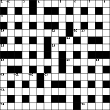
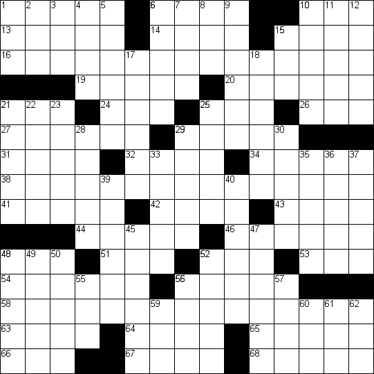
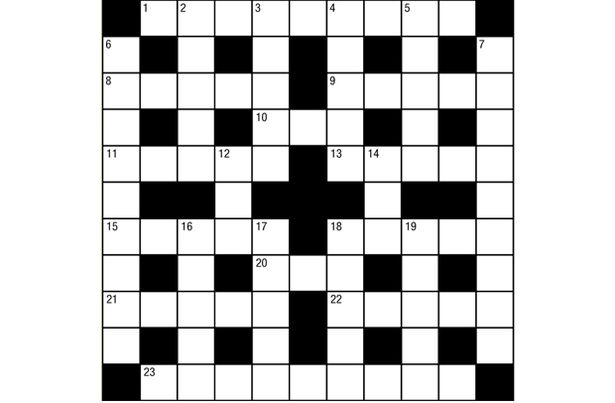

CrossWord Puzzle using Genetic Algorithm
----------------------------------------

A solution to form crossword puzzle given a fixed grid using Genetic Algorithm

## Crossword grids:

## Chromosome Representation:
List of words formed by sequence of letters on the grid

## Fitness function:
Penalty is added for each word not found in dictionary
Fittest individual has the least penalty

## Cross-over:
Replace a word from a parent with another parent's on the same position on the grid
Done for both parents

## Mutation:
Randomly choose a word from the offspring. Find suggested word to replace it, if available.

## Generation survivor:
Elitism
